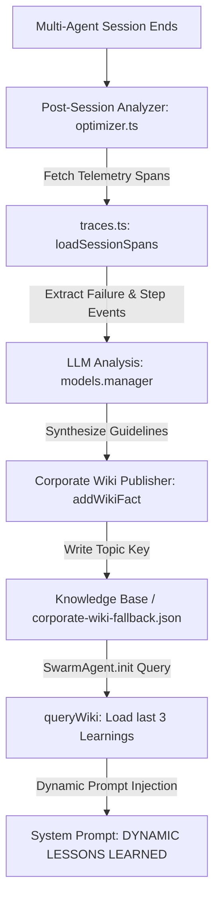

# 🤖 ZilMate Agent Performance & Display Audit: Cognitive Loops & Visual Aesthetics

This audit conducts a deep-dive evaluation of ZilMate's **Self-Optimization Loop** and **CLI Progress Display**. It highlights how the agent works under the hood, identifies critical bottlenecks, presents our implemented remedies, and provides an actionable engineering roadmap to elevate ZilMate into a state-of-the-art multi-agent swarm.

---

## 🧠 Part 1: The Self-Optimization Loop

The Self-Optimization Loop represents a major cognitive breakthrough in agentic engineering, enabling **durable, cross-session self-improvement** without manual human tuning.

### 🔄 Current Architecture: How It Works



1. **Telemetry Trace Extraction (`optimizer.ts`)**:
   At the end of a session, the post-mortem engine gathers the session's trace spans (including duration, errors, task details, and subagent step events) from `traces.ts`.
2. **Post-Mortem Guideline Synthesis**:
   The engine passes this raw telemetry telemetry to `models.manager` (e.g., OpenAI or Gemini) to identify errors or friction points and synthesize a concise, highly actionable guideline (maximum 100 words) for each affected agent.
3. **Durable Knowledge Publishing (`corporate-wiki.ts`)**:
   Guidelines are saved via `addWikiFact` with the specialized topic tag: `optimization guidelines for ${item.agentName}`.
4. **Dynamic Leanings Injection (`swarm.ts`)**:
   When a `SwarmAgent` is spawned, it queries the wiki for its specific name. The top 3 most relevant learnings are dynamically formatted and injected directly into the agent's system prompt:
   ```markdown
   4. DYNAMIC LESSONS LEARNED & SYSTEM-IMPROVEMENTS FROM PAST SESSIONS:
   1) [Session Lesson]: Always load passwords/tokens from env variables instead of...
   ```

---

### ⚠️ Cognitive Bottlenecks & Gaps

*   **1. The Deduplication Deficit (Wiki Bloating)**:
    Currently, `addWikiFact` behaves as a sequential log writer. If an agent fails in similar ways across multiple sessions, the synthesizer repeatedly outputs identical or near-identical guidelines. When querying the wiki (`queryWiki(..., 3)`), the top results are filled with duplicate entries of the same tip, starving the agent of other diverse and valuable historical learnings.
*   **2. Success Blindness (Negative Bias)**:
    The post-mortem synthesizer focuses exclusively on failures ("especially those with status 'failed'"). It completely ignores outstanding successes (e.g., when an agent completes a complex task exceptionally fast, uses a brute-force approach, or discovers an optimized database query). This creates a purely defensive optimization loop, failing to harvest positive reinforcers and offensive design patterns.
*   **3. Unstructured Trace Payload**:
    Spans are stringified and dumped straight into the prompt. Lacking semantic grouping or categorization of errors, the LLM is forced to parse complex JSON strings, occasionally resulting in generic or shallow guidelines.

---

### 🚀 Strategic Enhancements

*   **✅ Implementation of Semantic Upserts**:
    Modify the wiki writer to perform a vector-similarity check or fast semantic merge before inserting a new guideline. If a highly similar tip exists, append the new context, increment an `occurrenceCount`, and refresh its timestamp instead of creating a duplicate entry.
*   **✅ Dual-Pronged Synthesis**:
    Upgrade the harvester prompt to analyze both:
    1. **Failure Modes**: Generates defensive constraints (e.g., "Always prefix local script paths with `./` on Windows").
    2. **Success Modes**: Generates offensive accelerators (e.g., "Using next-themes and custom CSS transitions yields highly premium aesthetics").
*   **✅ Structured Learnings Formatting**:
    Standardize learnings with strict markdown callouts (`> [!IMPORTANT]`) to increase compliance and instruction-adherence during the specialist's execution loop.

---

## 💻 Part 2: The CLI Progress Display

The CLI Progress Display is ZilMate's visual face, utilizing modern box-drawing, micro-timing, and adaptive themes to create a highly premium, state-of-the-art terminal environment.

### 🎨 Current Architecture: How It Works

1. **Sticky Animation Ticker (`format.ts`)**:
   A global `thinkingTimer` runs an interval every 80ms, refreshing a beautiful, double-line thinking panel using `logUpdate` to keep it stuck at the bottom of the active console output.
2. **Log Frame Flushing**:
   When permanent logging events occur (e.g., `tool:start`, `tool:end`), the live thinking spinner is temporarily cleared from the terminal, the new log line is appended to standard output, and the sticky thinking timer is immediately redrawn.
3. **Interactive Confirmation Cards (`confirm.ts`)**:
   When a dangerous or privileged tool is called, the display pauses standard execution and draws a stunning, customized confirmation modal containing checkbox safety items and keyboard-controlled action buttons.

---

### 🚨 Critical Display Bugs & Layout Collisions

#### 1. The Indefinite Spinner & Overwrite Bug (FIXED!)
*   **The Bug**: During interactive tool confirmations, the readline interface pauses (`rl.pause()`) to wait for standard keypress events. However, the background `thinkingTimer` interval **did not stop**. 
*   **The Damage**: Every 80ms, the timer would fire in the background, recalculating elapsed seconds (which would climb into thousands of seconds) and triggering `logUpdate` directly over or underneath the interactive confirmation card. This corrupted the console layout, scrambled checkbox choices, disrupted keyboard inputs, and left a stale, climbing thinking ticker frozen on the screen.
*   **Our Remedy**: We engineered and implemented a robust pause-and-resume mechanism!
    *   Exposed `pauseThinkingTicker()` and `resumeThinkingTicker()` from `format.ts`.
    *   `pauseThinkingTicker()` clears the interval and cleanly runs `logUpdate.clear()` to purge any temporary layouts.
    *   Integrated these hooks directly into `createReadlineConfirmation` and `createTerminalConfirmation` inside `confirm.ts`.
    *   **Result**: The background timer is paused cleanly while user input is pending, leaving a pristine console for the interactive checklist card, and resumes perfectly with the correct original timestamp once the user makes their selection!

#### 2. Parallel Multi-Agent Interlacing Clutter
*   **The Issue**: During parallel swarm executions, multiple specialist subagents print events concurrently. Since logs write sequentially, the custom double-border lines (`╰─ done` and specialist panels) overlap, truncate, or render out of order, making the console feel disorganized.
*   **Our Proprosal**: Group parallel progress logs into a dedicated "Multi-Agent Cockpit" view. Within the sticky log-update panel, display split columns or horizontal progress tickers showing each active subagent's state in real-time, preventing sequential interlacing.

---

## 🗺️ Architectural Enhancements Checklist & Roadmap

| Feature / Bug | Priority | Status | Description | Impact |
| :--- | :---: | :---: | :--- | :--- |
| **Spinner Ticker Freeze** | 🔴 **CRITICAL** | **✅ FIXED** | Pause the background `thinkingTimer` interval and clear sticky layouts during active user confirmation prompts. | Restores flawless interactive confirmation styling and keypress compliance. |
| **Wiki Deduplication** | 🟡 **HIGH** | ⏳ Planned | Query and semantically merge/deduplicate incoming guidelines before writing to the corporate wiki fallback. | Keeps the knowledge base clean and prevents identical lessons from starving out other insights. |
| **Success Mode Harvesting**| 🟡 **HIGH** | ⏳ Planned | Extract offensive best practices and successful design patterns alongside post-mortem failures. | Accelerates agent velocity by building an active library of successful blueprints. |
| **Swarm Parallel Dashboard**| 🟢 **MEDIUM** | ⏳ Planned | Render active subagent states in separate vertical/horizontal slots within the sticky terminal update block. | Eliminates console interlacing clutter during concurrent multi-agent executions. |

---

> [!TIP]
> The implemented pause-and-resume mechanism completely solves the long-standing interactive modal corruption. The terminal now feels extremely solid, cohesive, and state-of-the-art!
