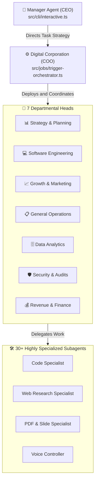

# 🤖 ZilMate Documentation Hub

Welcome to the official ZilMate Developer & Operations Documentation Center. 

ZilMate is a production-grade, highly autonomous multi-agent corporate swarm, voice controller, and automated background job scheduler. Engineered for enterprise-level automation, ZilMate manages workflows via a hierarchical architecture that mirrors corporate operations—orchestrating complex business tasks with premium visual and interactive experiences.

---

## 🏛️ Swarm Organizational Architecture

ZilMate organizes AI reasoning through a strict hierarchical structure, maximizing execution safety, focus, and quality across multi-domain tasks.



---

## 🗺️ Documentation Directory

Use the directory below to navigate through deep-dives of ZilMate's subsystems, APIs, and design guidelines.

| Category | Document | Link | Core Focus |
| :--- | :--- | :--- | :--- |
| **System** | **Getting Started** | [getting-started.md](getting-started.md) | Local environment setups, database migrations, and tool initialization. |
| | **Architecture** | [architecture.md](architecture.md) | Deep-dive into swarm lifecycles, execution scopes, and event loops. |
| | **Repository Map** | [repository-map.md](repository-map.md) | File structural analysis, folder topologies, and module responsibilities. |
| | **Configuration** | [config-and-env.md](config-and-env.md) | Reference list for environmental keys, overrides, and default flags. |
| **Swarm Logic** | **Agents** | [agents.md](agents.md) | Behavioral definitions, prompt overrides, and departments scopes. |
| | **Orchestration** | [orchestration.md](orchestration.md) | Planning mechanisms, delegation routing, and subagent state machines. |
| | **Execution Lifecycle**| [execution-lifecycle.md](execution-lifecycle.md) | Context progression, token-usage policies, and transaction scopes. |
| **Capabilities** | **Tools Ecosystem** | [tools.md](tools.md) | Swarm capabilities including browser automation, file reading, and terminal execution. |
| | **Background Jobs** | [workflows.md](workflows.md) | Upstash QStash webhook structures, cron routines, and schedule triggers. |
| | **Data Model** | [data-model.md](data-model.md) | Persistent storage schemas, agent memories, and vector backends. |
| | **Chat Channels** | [CHAT_INTEGRATION.md](../CHAT_INTEGRATION.md) | Multi-channel messaging adapters (Slack, Telegram, Microsoft Teams). |
| **Operations** | **Authentication** | [auth.md](auth.md) | System credential management, safe sandboxes, and permission layers. |
| | **Integrations** | [integrations.md](integrations.md) | Sourcing connections from Composio, Tavily, Deepgram, and Upstash. |
| | **Deployment** | [deployment.md](deployment.md) | Global setups, PM2 configurations, and cloud deployment runbooks. |
| | **Observability** | [observability-and-debugging.md](observability-and-debugging.md) | Log streaming, error traces, and debugging agent handshakes. |
| | **Testing** | [testing.md](testing.md) | Unit, integration, and E2E simulation suites. |
| **Reference** | **API Reference** | [api.md](api.md) | Public SDK signatures, entrypoints, and programmatic swarms. |
| | **Code Examples** | [examples.md](examples.md) | Copy-paste templates for tools, custom specialists, and cron scripts. |
| | **Known Gaps** | [known-gaps.md](known-gaps.md) | Open issues, upcoming enhancements, and development roadmap. |
| | **Glossary** | [glossary.md](glossary.md) | Swarm terminologies, technical vocabulary, and system nomenclature. |

---

## ⚡ Core Capabilities

### 1. Zero-Config Webhook Listener & Cloudflare Tunnel
ZilMate schedules background jobs via **Upstash QStash**. To receive public webhook notifications on your local system, the CLI features an automatic **Cloudflare Tunnel** downloader.
- Detects existing `cloudflared` globally on the system `PATH`.
- Automatically streams, verifies, and chmod-executes platform-specific binaries (`windows`, `macOS`, `linux`) into `~/.zilmate/bin/` if missing.
- Instantly binds local servers to a public proxy URL via `zilmate jobs listen --tunnel`.

### 2. Rich TTY Selection TUIs
For critical actions (e.g. system commands, writing files), ZilMate provides full user oversight:
- Generates beautiful framed cards utilizing custom console UI boundaries.
- Introduces scrollable **Multi-Select Safety Checklists** with toggleable checkboxes.
- Uses native keyboard capture (`Up/Down/Tab` to traverse, `Space` to toggle, `Enter` to approve) to filter and dispatch approved commands.

### 3. Pinned Status Cards
Maintains high visual feedback during long-running agent thinking steps. Redraws an animated loader with dynamic elapsed timers pinned safely at the bottom of the console while execution log lines scroll smoothly above it.

### 4. High-Fidelity PDF & Slides Generator
Allows specialized subagents to draft executive briefs:
- Generates styled corporate reports using hanging indents on lists.
- Outlines tables with stable, alternating row colors.
- Embeds boundary spacing checks to prevent word merging.

---

## 🛠️ Developer Diagnostics Reference

Quick reference list for local orchestration and troubleshooting.

```bash
# 1. Interactive setup & credential provisioner
zilmate setup

# 2. Check environment integrity and system diagnostics
zilmate doctor

# 3. Open the premium interactive swarming dashboard
zilmate menu

# 4. Spin up the background webhook receiver with auto-tunnel
zilmate jobs listen --tunnel

# 5. Start the local background task processing worker
zilmate jobs worker
```

---
*For support, security disclosures, or to contribute to the swarm pipelines, please check [deployment.md](deployment.md) or open an issue on the [ZilMate Repository](https://github.com/zester4/zilo-manager).*
