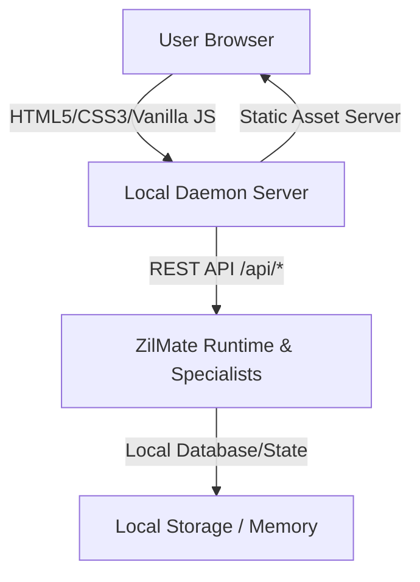

# ZilMate Web Command Center

The ZilMate Web Command Center is a premium, state-of-the-art interactive web console designed to manage, test, and coordinate your multi-agent digital corporation. It serves as a visual wrapper matching and exceeding the power of the rich ZilMate CLI, providing seamless agent collaboration, live traces, and system configuration directly in the browser.

---

## Architecture Overview

The Web Command Center utilizes a lightweight, local-first decoupled architecture:



1. **Local Daemon (Backend)**: Served on local port `8124` by the background daemon daemon process. It serves static client assets and exposes endpoints under `/api/*` for chat transactions, model configuration, traces, health diagnostics, corporate memory, and wiki search.
2. **Web Command Center Client (Frontend)**: Crafted using pure semantic HTML5, high-performance vanilla CSS, and event-driven JavaScript. It avoids heavy framework overhead while maintaining a state-of-the-art responsive design system.

---

## Features Checklist & Capabilities

### 💬 Interactive Chat Command Console
* **Custom Markdown Parser**: Renders clean, readable typographic elements for system outputs, including headers, nested bulleted and numbered lists, paragraphs with exact spacing, and blockquotes.
* **Premium Code Code Block Fences**: Fences and wraps terminal output and code snippets inside a gorgeous dark block with interactive copy-to-clipboard actions and language labels.
* **Responsive Layout Tables**: Dynamically formatted data matrices and tables.
* **Pulsing Typing Indicators**: Micro-animated elements to indicate background agent computation and specialist swarm planning.

### ⌨️ Autocomplete Slash Commands
Typing a forward slash (`/`) in the input box triggers a floating, keyboard-navigable autocomplete panel showing:
* `🩺 /doctor` — Run full system health diagnostics and background check status.
* `⚡ /skills` — List specialized agent capabilities, triggers, and registered custom skill templates.
* `🧩 /mcp list` — Show currently connected Model Context Protocol servers and their arguments.
* `🐝 /swarm` — Delegate complex goals to the multi-agent specialist swarm hierarchy.
* `📅 /jobs` — View or schedule recurring corporate tasks.
* `🧠 /memory` — Browse and query long-term digital memories stored in the local memory bank.
* `📚 /wiki` — Search corporate intelligence fact sheets and architectural guidelines.

Users can navigate autocomplete matches using `ArrowUp` or `ArrowDown` and hit `Enter` to auto-fill the selected command into the input bar.

### 🗂️ Session Management & Persistence
* **Dropdown Selection**: Dynamically lists and manages parallel chat contexts (`web-session`, `default`, `ubiquity`, etc.).
* **On-the-Fly Creation**: Selecting `+ Create New...` opens a prompt to instantly instantiate and register a custom session ID.
* **Clean Session Synced Clearing**: Selecting `Clear History` deletes active session turns from the backend's JSON-based storage while resetting the frontend state and welcome greeting.
* **LocalStorage Synchronization**: Sessions are persisted in the browser's `localStorage` so your workspace layout remains perfectly intact upon reload.

### 🤖 Active Model Badge Indicator
* **Live Status**: Shows which active model is assigned for interactive chat or management.
* **Pulsing Indicator**: Displays a glowing, breathing green dot indicating model readiness.

### ⚡ Quick Suggestion Chips
* Clickable chips located above the input bar allow instant execution of common commands (e.g., Run Doctor, Swarm, Workspace Audit).

### 🎙️ Realtime Voice & Camera Shortcut
* Floating voice buttons allow users to jump instantly to the **Realtime Voice** or **Camera Tools** tabs with interactive audio waveform visualization.

---

## Getting Started

### 1. Launching the Web Command Center

You can start the daemon and open the Command Center using either of the following methods:

**Using npm scripts:**
```bash
npm run web
```

**Using the CLI direct binary command:**
```bash
zilmate web
```

This will automatically start the background server on `http://127.0.0.1:8124` and automatically open your default browser.

### 2. Authentication and Security
Static client assets and API requests require session validation via an authorization token. When running `zilmate web` or `npm run web`, the CLI automatically appends a secure single-use token to the URL query string (e.g., `?token=...`), which is securely saved in the client browser's `localStorage` for all subsequent REST interactions.

---

## Directory Structure

* [webcli/html/index.html](file:///c:/Users/mseyy/Downloads/zilo-manager/webcli/html/index.html) — Structural layout, headers, dropdowns, and views containers.
* [webcli/html/styles.css](file:///c:/Users/mseyy/Downloads/zilo-manager/webcli/html/styles.css) — Custom responsive glassmorphic design system containing variables, interactive animations, and markdown formatting.
* [webcli/html/script.js](file:///c:/Users/mseyy/Downloads/zilo-manager/webcli/html/script.js) — Interactive state machine, custom parsing engines, autocomplete logic, API fetch, and DOM event bindings.
* [src/daemon/service.ts](file:///c:/Users/mseyy/Downloads/zilo-manager/src/daemon/service.ts) — Background daemon REST endpoint routers and static file server logic.
