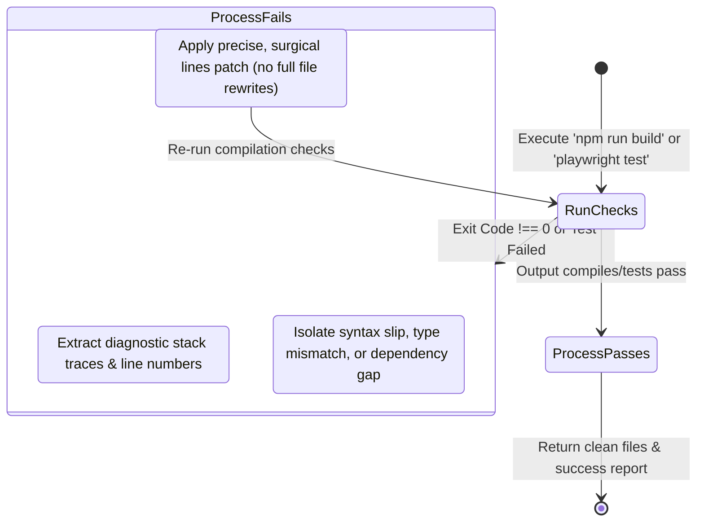

# ZilMate SDK: Autonomous Software Engineering

The **ZilMate Coding Agent** (`.coding()`) is a state-of-the-art agentic software developer capable of creating, refactoring, compiling, testing, and debugging applications. It does not simply generate snippets; it operates directly on source repositories inside a sandboxed, self-healing loop.

---

## 1. The Three-Tier Engineering Architecture

Rather than relying on a single general-purpose prompt to write and verify code, the Coding Agent orchestrates a structured, three-tiered team of specialized subagents:

```mermaid
graph TD
    UserPrompt[User prompt to .coding()] --> Orchestrator[Coding Orchestrator]
    
    subgraph Execution Loop
        Orchestrator -->|Delegates UI/Logic Scaffold| AppBuilder[App Builder Specialist]
        AppBuilder -->|Saves Code edits| Repo[Working Tree Files]
        
        Orchestrator -->|Delegates Compilation & Tests| QA[QA & Integration Specialist]
        QA -->|Runs compiler/test suites| Run[Compile / Playwright / Jest]
        
        Run -->|Check Failed| QA
        QA -->|Autonomous Self-Heal| Repo
    end

    Orchestrator -->|Final Check & Commit| Git[Git Commit / PR]
```

### The Specialist Roles

1. **Coding Orchestrator (`createCodingAgent`)**: Acts as the Lead Systems Architect and Project Manager. Inspects system context, pulls relevant framework skills (such as Next.js or Drizzle), assigns tasks to subagents, and applies surgical Git commits.
2. **App Builder (`createAppBuilderAgent`)**: The implementation powerhouse. Specializes in scaffolding directories, configuring database models, and constructing beautiful interfaces conforming to premium visual guidelines.
3. **QA & Integration (`createQaIntegrationAgent`)**: The gatekeeper. Writes Playwright/Vitest test suites, checks build compilation, isolates errors, and executes self-healing code-patching cycles.

---

## 2. Programmatic Execution (`.coding()`)

You call the Coding Agent directly from the SDK by passing a prompt detailing your requirements.

```typescript
import { createZilMate } from 'zilmate/server';

const zilmate = createZilMate({ sessionId: 'billing-v2-migration' });

console.log('🚀 Spawning the Coding Agent...');
const { text } = await zilmate.coding({
  prompt: `
    In our Next.js repository:
    1. Scaffold a new glassmorphic payment dashboard page under app/dashboard/billing/page.tsx.
    2. Define a mockup ledger database schema using Prisma / Drizzle under src/db/schema.ts.
    3. Run 'npm run build' to ensure the compilation is error-free.
    4. Provide a report of the exact files changed and the build logs.
  `
});

console.log('✅ Task Complete. Developer Report:');
console.log(text);
```

---

## 3. Premium Design & Engineering Standards

When the **App Builder** scaffolds code, its upgraded instructions enforce high-end frontend styling. It completely bypasses basic browser defaults to deliver stunning, custom-built interfaces:

- **🎨 Harmonious Color Palettes**: Prefers tailored HSL-based palettes (sleek dark modes, deep space blues, neon cyan highlights) over generic colors.
- **✨ Glassmorphic Layouts**: Constructs interfaces using semi-transparent white borders, blurred backdrops (`backdrop-blur-md`), and glowing gradients.
- **📱 Responsive Bento Grids**: Organizes information cards into modern, interactive grid columns.
- **🔤 Modern Typography**: Dynamically imports premium Google Fonts (like Inter, Outfit, or Roboto) to style headers and paragraphs.
- **🎛️ Hover Micro-Animations**: Attaches active transitions, scaling, and glow animations to buttons, cards, and input fields to make interfaces feel reactive and alive.
- **🚫 No TODO Placeholders**: Write fully working logical routines and APIs. If database setups are requested, the builder implements actual functional mock schemas instead of empty comments.

---

## 4. The Autonomous Self-Healing Dev Loop

When code compilation, linting, or tests fail, the **QA & Integration** agent initiates an autonomous healing cycle. It does not escalate the failure to the developer; instead, it repairs the issue in place.



### Self-Healing Mechanics under the Hood

- **Step A: Parse & Isolate**: The QA agent reads compiler streams, capturing exact line numbers, missing import diagnostics, and test failure reasons.
- **Step B: Formulate Fix**: It reasons about why the compilation broke. (e.g. "Did we import `Session` from the wrong authentication library?").
- **Step C: Surgical Repair**: Instead of overwriting files in their entirety, the agent utilizes pinpoint search-and-replace tools (`patchFile`, `applyUnifiedPatch`) to fix the precise character coordinate.
- **Step D: Re-run & Iterate**: It re-executes compilation. If another failure is hit, it repeats the loop. It iterates until all tests and compilation checks pass, or standard safety step limits are reached.
