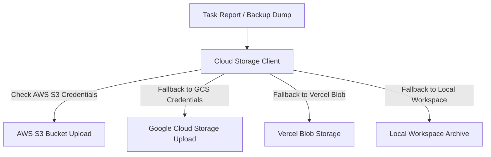

# ZilMate SDK: Sandboxed Host Utilities

To bridge the gap between AI generation and real-world system tasks, the ZilMate SDK incorporates an elite, fully sandboxed cross-platform **Host Utility Suite**. These utilities allow agents to safely inspect infrastructure, run network diagnostics, back up files to cloud endpoints, and process multimedia directly.

---

## 1. ⚙️ DevOps Docker Suite

ZilMate managers can manage, review, and query local and remote Docker environments. This ensures DevOps and Site Reliability Specialists can monitor server deployments dynamically.

```typescript
import { createZilMate } from 'zilmate/server';

const zilmate = createZilMate({ sessionId: 'infra-monitoring' });

const { text } = await zilmate.manager({
  message: `
    List all running Docker containers, check their CPU load, and pull the last 30 lines
    of logs from our main API container. If any container is restarted or down, notify me.
  `
});

console.log(text);
```

### Supported DevOps Operations

- `listDockerContainers()`: Fetches metadata of all active containers, including creation dates, ports, and status.
- `getDockerContainerLogs({ containerId, tail: 50 })`: Streams container output stdout/stderr diagnostics.
- `controlDockerContainer({ containerId, action: 'start' | 'stop' | 'restart' })`: Standard system container management commands.
- `validateEnv()`: Inspects current process environment configurations without leaking sensitive private keys.

---

## 2. 🛡️ SysOps Networking Suite

When servers crash, API gateways timeout, or databases fail to connect, SRE specialists can deploy low-level networking probes to diagnose DNS, routing, and schema issues.

```typescript
const { text } = await zilmate.manager({
  message: `
    Our staging database (postgres-prod-db) seems unreachable.
    Please run a ping, trace the hops, probe port 5432, and check if it accepts connections.
  `
});
```

### Diagnostic Probes

- `listOpenPorts({ host })`: Runs a quick socket-scan across typical operational ports.
- `pingHost({ host })`: Standard network ping packets.
- `traceRoute({ host })`: Traces the path packets take across hop routers to isolate network bottlenecks.
- `getDatabaseSchema({ dbPath })`: Connects to local SQLite databases to return typed tables, schemas, indexes, and schemas contracts.

---

## 3. ☁️ Tiered Multi-Cloud Storage Client

Generating data-heavy reports, dumps, or backups is only useful if they can be securely archived. ZilMate implements a tiered Cloud Client that automatically leverages available credentials.

```typescript
const { text } = await zilmate.manager({
  message: `
    Generate a CSV export of our task ledger and back it up to our cloud storage.
    Use AWS S3 if credentials exist, otherwise default to our Vercel Blob store.
  `
});
```



---

## 4. 🎥 Multimedia FFmpeg & Transcription

ZilMate hosts a powerful media suite that utilizes local binary assets to handle transcoding, audio stripping, and AI transcription interfaces.

```typescript
const { text } = await zilmate.manager({
  message: `
    Locate the landing-video-intro.mp4 in our workspace:
    1. Extract the audio track to landing-audio.wav.
    2. Transcode the video to 720p H.264 format with a web-optimized layout.
    3. Run our speech-to-text transcriber to generate subtitles.
  `
});
```

### Media Suite Methods

- `transcodeVideo({ inputPath, outputPath, resolution, videoCodec })`: Adjusts video parameters using sandboxed FFmpeg commands.
- `extractAudio({ videoPath, outputPath })`: Safely strips audio tracks into high-fidelity WAV or MP3 files.
- `speechToText({ audioPath })`: Interfaces with Deepgram or whisper layers to parse spoken sentences into structured text and timestamped transcripts.
