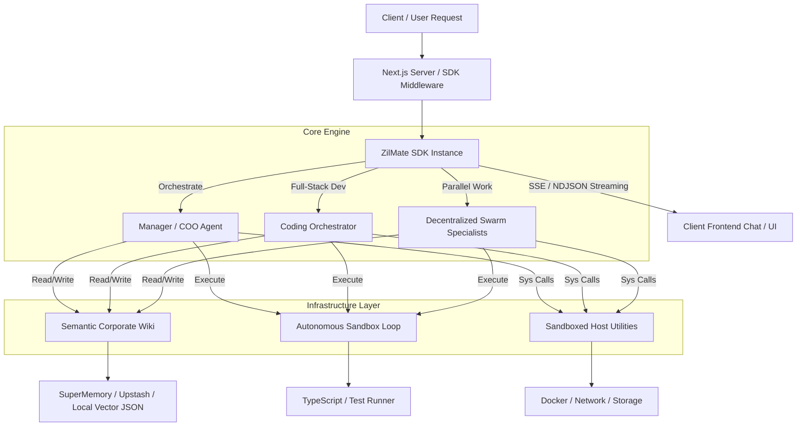

# ZilMate SDK: Architectural Introduction

Welcome to the **ZilMate SDK**—the enterprise-grade agentic middleware designed to embed autonomous AI workers, decentralized swarms, semantic memory systems, and sandboxed operating system utilities directly into your Node.js, server, and serverless applications.

---

## What is ZilMate?

ZilMate is not just an LLM wrapper; it is a **comprehensive runtime environment** for multi-agent systems. It enables you to orchestrate single main managers, specialized development pipelines, parallel swarms, durable cron workers, and voice loops with full sandbox safety controls, observability trace trees, and memory consistency.

---

## Core Capabilities

| Capability | Key System Modules | Description |
|:---|:---|:---|
| **Manager Orchestrator** | `createZilMate().manager()` | Routes user intent, maintains state continuity, pulls live situation briefs, and coordinates sub-threads. |
| **Full-Stack Coding Suite** | `createZilMate().coding()` | Coordinates specialized **App Builder** and **QA Integration** subagents inside self-healing code test-repair loops. |
| **Decentralized Swarm** | `createSwarmSpecialist()` | Launches 30+ specialists across 6 core departments that horizontally coordinate via peer-to-peer Joint War Rooms. |
| **Semantic Corporate Wiki** | `publishToWiki() / queryWiki()` | Shared blackboard that indexes strategic decisions, database schemas, and session learnings across all agents. |
| **Durable Jobs & Scheduling** | `createJob() / handleWebhook()` | Schedules cron-based operations, manages background queues, and coordinates QStash serverless webhook processing. |
| **Voice & Speech-to-Text** | `startVoiceSession()` | Powers real-time interactive voice interactions using Deepgram speech-to-text / text-to-speech integration. |
| **Host Utilities Suite** | DevOps / SysOps Tools | Sandboxed tools for managing Docker engines, network diagnostics, tiered cloud storage, and video processing. |

---

## Environment Variables Reference

To activate the full capabilities of the ZilMate SDK, set the following variables in your `.env` file. These can also be passed at runtime as standard Node process variables.

> [!IMPORTANT]
> The only strictly required variable is `AI_GATEWAY_API_KEY`. All other parameters are optional and act as gateways to unlock advanced agentic features (such as Redis caching, SuperMemory wiki indexing, and Docker orchestrations).

| Environment Variable | Description | Category | Feature Unlocked |
|:---|:---|:---|:---|
| `AI_GATEWAY_API_KEY` | Authentication token for the central model gateway. | Required | Gateway access to Claude, GPT-4, and specialist LLMs. |
| `ZILMATE_USER_ID` | Session identifier key for tracking long-term memory. | Optional | Session isolation & custom persistent profiling. |
| `ZILMATE_WORKSPACE` | Root folder for durable files, logs, and trace exports. | Optional | Custom workspace persistence (defaults to user Downloads). |
| `COMPOSIO_API_KEY` | Access key for system integrations and secure CRM loops. | Optional | Access to GitHub, HubSpot, Linear, Notion integrations. |
| `TAVILY_API_KEY` | Multi-source deep-web research platform access token. | Optional | Advanced document/web sourcing inside the Research Agent. |
| `DEEPGRAM_API_KEY` | Speech-to-text / Speech-to-speech engine key. | Optional | Real-time interactive telephone and microphone voice loops. |
| `UPSTASH_REDIS_REST_URL` | Upstash Redis connection URL for serverless environments. | Optional | Multi-instance durable memory, job queues, and locking. |
| `UPSTASH_REDIS_REST_TOKEN`| Upstash Redis auth token. | Optional | Pair with URL for serverless Redis backend authentication. |
| `AWS_ACCESS_KEY_ID` | AWS IAM credential key. | Optional | Storage uploads to S3 buckets during backup/restore. |
| `AWS_SECRET_ACCESS_KEY` | AWS IAM credential secret. | Optional | Pair with key to authorize secure AWS S3 client storage. |
| `AWS_DEFAULT_REGION` | Target AWS datacenter region (e.g., `us-east-1`). | Optional | Standardizes cloud storage bucket destinations. |
| `GOOGLE_APPLICATION_CREDENTIALS` | Path to JSON file containing GCS service credentials. | Optional | Alternative cloud storage uploads to Google Cloud Buckets. |
| `BLOB_READ_WRITE_TOKEN` | Read/write authentication token for Vercel Blob. | Optional | Low-latency cloud file and asset hosting for web apps. |
| `CORPORATE_WIKI_PROVIDER` | Wiki vector engine selection (`supermemory` \| `upstash`). | Optional | Overrides local fallback database for high-scale wiki storage. |
| `SUPERMEMORY_API_KEY` | Corporate Wiki SuperMemory connection token. | Optional | Synced indexing into your central SuperMemory dashboard. |
| `UPSTASH_VECTOR_REST_URL`| Connection string to Upstash Vector DB index. | Optional | Semantic storage of database schemas, API specs, and ADRs. |
| `UPSTASH_VECTOR_REST_TOKEN`| Auth token for Upstash Vector DB index. | Optional | Authorizes secure Vector DB inserts and queries. |
