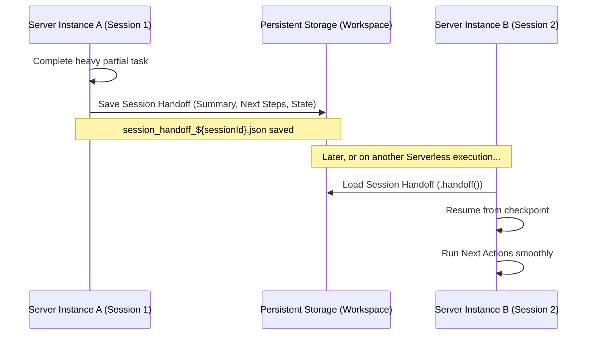

# ZilMate SDK: The Manager Orchestrator

The **Manager Orchestrator** is the central command center of any ZilMate SDK instance. Initiated via `.manager()`, it parses complex human intent, maps sub-tasks to specialized subagents, pulls real-time environmental context, and maintains conversational safety boundaries.

---

## 1. Core Manager Method

The SDK exposes two principal methods for orchestrating tasks:
- `manager()`: The full agentic orchestrator. Has access to all tools, long-term memory, subagents, and situational briefs. Use this for open-ended, complex tasks.
- `chat()`: A lightweight, low-latency conversational agent. Ideal for direct chat interactions that do not require tool loops or file-system mutations.

```typescript
import { createZilMate } from 'zilmate/server';

const zilmate = createZilMate({ sessionId: 'user_prod_101' });

// Lightweight chat
const chatReply = await zilmate.chat({ message: 'Hello! Who are you?' });

// Elite multi-step orchestration
const managerReply = await zilmate.manager({
  message: 'Analyze our local Docker container logs and compile a brief report.'
});
```

---

## 2. Situational Awareness (`.situation()`)

A key differentiator of ZilMate is its ability to build high-fidelity **situational awareness** before taking actions. The `.situation()` method inspects the server or host environment to build a snapshot of its current state.

```typescript
const brief = await zilmate.situation({ sessionId: 'user_prod_101' });

console.log('--- SYSTEM BRIEF ---');
console.log('Workspace CWD:', brief.cwd);
console.log('Active Git Branch:', brief.git?.branch);
console.log('Git Uncommitted Changes:', brief.git?.dirtyFilesCount);
console.log('Database Schema Version:', brief.databaseSchemaVersion);
console.log('Active Queued Jobs:', brief.recentJobs?.length);
```

### Context Injection Flow

The orchestrator calls this brief internally before tackling complex instructions. For instance, if you tell it to "fix compilation errors," it does not guess; it checks:
1. What files are currently modified or untracked in Git.
2. The current Node.js and package manager version.
3. System logs and database schemas.

---

## 3. Session Continuity & Handoffs

In standard LLM setups, restarting a thread means losing all context, state, and planning. ZilMate mitigates this with **Autonomous Handoffs**. 

Before completing a complex sequence, or when a workflow requires a pause (e.g., waiting for external webhook callbacks), the orchestrator saves a structured session handoff JSON to the database.



### Capturing and Resuming Session Checkpoints

```typescript
import { createZilMate } from 'zilmate/server';

const sessionId = 'durable_onboarding_task';
const zilmate = createZilMate({ sessionId });

// 1. Attempt to restore a previous checkpoint
const priorHandoff = await zilmate.handoff();

let taskPrompt = 'Walk me through setting up our main Stripe payment credentials.';

if (priorHandoff) {
  taskPrompt = `
    [RESUMING CONTEXT FROM CHECKPOINT]
    Prior Summary: ${priorHandoff.summary}
    Completed Tasks: ${priorHandoff.completedActions.join(', ')}
    Pending Action items: ${priorHandoff.nextActions.join(', ')}
    
    Please proceed with the next step: "${priorHandoff.nextActions[0]}".
  `;
}

// 2. Execute the manager with the restored session state
const { text } = await zilmate.manager({ message: taskPrompt });
console.log(text);
```

---

## 4. Interactive Approvals & Safe Execution

By default, the SDK runs in a fully autonomous mode. However, when executing in high-security production environments, you must prevent agents from running destructive mutations (e.g., deleting files, installing arbitrary packages, or dropping tables) without explicit human consent.

You can configure an asynchronous `confirm` handler on the SDK instance. The SDK pauses execution when a restricted tool is called and awaits your handler's resolution.

```typescript
import { createZilMate, type ConfirmationHandler } from 'zilmate/server';

// Create a custom confirmation interceptor
const securityConfirmHandler: ConfirmationHandler = async (request) => {
  console.log(`\n🛡️ [SECURITY INTERCEPT] restricted tool execution requested.`);
  console.log(`Agent Name: ${request.agentName}`);
  console.log(`Tool Requested: ${request.toolName}`);
  console.log(`Action Rationale: ${request.message}`);
  console.log(`Payload Arguments:`, JSON.stringify(request.args, null, 2));

  // In a terminal app, prompt stdin:
  if (process.env.NODE_ENV === 'development') {
    const approve = await promptUserInTerminal();
    return approve; // Returns boolean (true = run tool, false = block & return error)
  }

  // In a Web/SaaS dashboard context:
  // 1. Save the confirmation request to a pending approvals database.
  // 2. Send a WebSocket ping to the client or Slack webhook.
  // 3. Block and await the user's click.
  const approvalId = await saveToApprovalsDatabase(request);
  const approve = await pollForUserClick(approvalId);
  return approve;
};

const zilmate = createZilMate({
  sessionId: 'secure_sandbox_session',
  confirm: securityConfirmHandler
});
```

### Confirmation Request Schema

The `ConfirmationRequest` object contains the following properties:

| Property | Type | Description |
|:---|:---|:---|
| `id` | `string` | Unique identifier for this confirmation transaction. |
| `agentName` | `string` | Name of the agent seeking clearance (e.g. `App Builder`). |
| `toolName` | `string` | Exact name of the tool (e.g. `deleteFile`, `runCommand`). |
| `message` | `string` | Explanation written by the agent explaining *why* it needs this tool. |
| `args` | `Record<string, any>` | The raw parameter arguments passed to the tool. |
