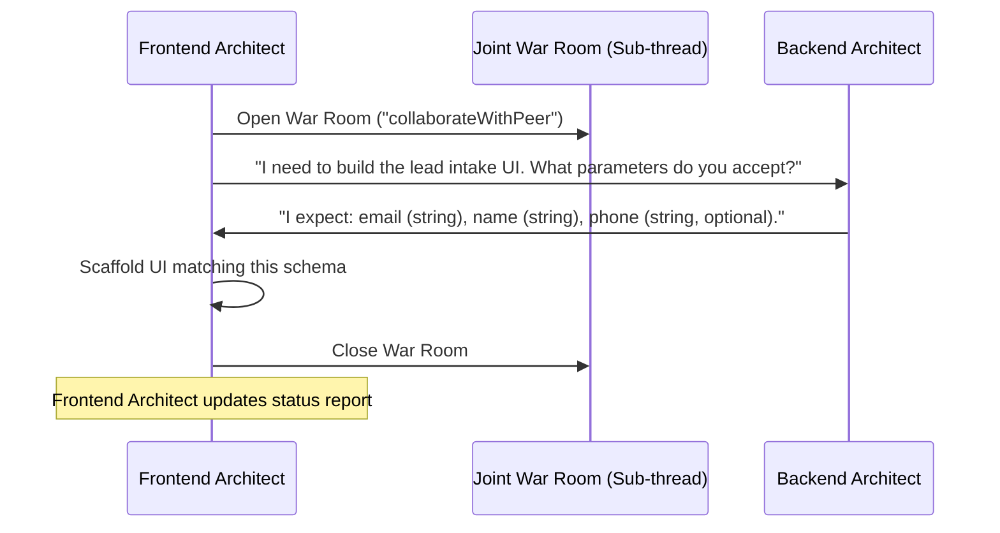

# ZilMate SDK: Decentralized Swarms

The **ZilMate Swarm Engine** is designed to execute multi-agent business operations. Instead of routing every single action through a centralized manager, ZilMate organizes a decentralized network of **30+ specialized AI agents** that communicate, negotiate, and collaborate directly with one another.

---

## 1. Corporate Departments & Specialists

ZilMate organizes specialists into **6 core divisions**. Each specialist has custom system instructions and a focused toolkit designed for high-end professional tasks.

| Department | Specialist Key | Primary Domain | Focused Integrations / Skills |
|:---|:---|:---|:---|
| **Strategy & Product** | `productManager` | Roadmap & Issue Specs | GitHub, Linear, `design-md` |
| | `marketAnalyst` | Competitive Research | Twitter, Reddit, `firecrawl-deep-research` |
| | `uxResearcher` | User Experience & Audits | Browser session logs, `ui-ux-pro-max` |
| **Engineering & Design**| `architect` | ADR Design & Contracts | System schemas, `next-best-practices` |
| | `fullStackCoder` | Code Implementation | Git, VS Code, `neon-drizzle` |
| | `qaEngineer` | Test Suites & Dev Loops | Playwright, Jest, `playwright-best-practices`|
| | `devopsSre` | Cloud & Docker Engines | Render, AWS, Vercel, Docker daemon |
| | `creativeDirector` | Graphic Assets & Prompts | Image generators, `ad-creative` |
| | `securityAuditor` | Penetration & Safety Checks | Dependency reviews, sandbox scans |
| **Development Specialists**| `frontendArchitect` | UI Foundations & Styling | Styling systems, layout tokens, Tailwind v4 |
| | `backendArchitect` | API Routes & Middleware | Route handlers, edge limits, CORS, auth |
| | `dbSpecialist` | DB Schemes & Migrations | PostgreSQL, Drizzle, Prisma, Neon |
| | `salesOps` | CRM Syncing & Leads | HubSpot CRM, Salesforce, Notion |
| **Growth & Marketing** | `growthHacker` | Funnel CRO Optimization | Conversion analytics, Stripe metrics |
| | `seoExpert` | On-Page & AI Search SEO | SEO health, meta tags, `ai-seo`, `seo-audit`|
| | `contentWriter` | Articles & Documentation | Marketing copy, `copywriting`, `copy-editing`|
| **Operations & Legal** | `financeAnalyst` | Ledger Syncs & Auditing | Stripe ledger exports, tax sheets |
| | `customerSuccess` | Feedback Routing & Tickets | Zendesk, Discord, Email automation |
| | `legalCounsel` | Privacy & Terms Audits | Compliance, TOC drafts, privacy policies |
| **Data & Automation** | `agentOptimizer` | Prompt & Memory Tuning | Learning harvesting, `skill-creator` |

---

## 2. Joint War Rooms (`collaborateWithPeer`)

ZilMate specialists do not work in isolation. If the `frontendArchitect` needs to define a lead submission interface, they do not wait for the project manager. They invoke a **Joint War Room** with the `backendArchitect` to negotiate the JSON schema.



### Peer-to-Peer Tool Invocation

Under the hood, the `collaborateWithPeer` tool instantiates the requested specialist, sets up a shared conversation loop, executes the collaborative task, and returns the unified result back to the calling specialist.

---

## 3. Programmatic Swarm Specialist Calls

You can instantiate and execute individual swarm specialists directly within your scripts. This allows you to skip the Chief Operating Officer (COO) router and target a specialist directly.

```typescript
import { createSwarmSpecialist } from 'zilmate/server';

async function runSeoAudit() {
  // 1. Instantiate the specialist using its unique registry key
  const seoAgent = createSwarmSpecialist('seoExpert');

  // 2. Initialize the agent inside your specific session workspace
  await seoAgent.init('seo_landing_page_session');

  console.log('🌌 Triggering SEO Expert in isolation...');
  
  // 3. Run the task
  const report = await seoAgent.run(`
    Verify the SEO health of our homepage and write a metadata recommendation report.
    Ensure our page adheres to our "ai-seo" guidelines so search engines like ChatGPT and Perplexity can cite us.
  `);

  console.log('\n📊 SEO Specialist Report Saved:');
  console.log(report);
}

runSeoAudit().catch(console.error);
```

---

## 4. Swarm Observability (Trace Dashboards)

Running nested multi-agent systems can make debugging challenging. ZilMate includes a full **Trace Tracker** that logs every agent switch, tool call execution, and sub-thread war room.

### Generating Glassmorphic Live Dashboards

You can load session logs and render trees programmatically, or output a gorgeous glassmorphic HTML trace file.

```typescript
import { loadSessionSpans, renderTraceTree, generateHtmlDashboard } from 'zilmate/server';
import { writeFile } from 'node:fs/promises';
import path from 'node:path';

async function exportSwarmTrace(sessionId: string) {
  // Load trace steps recorded during the session
  const spans = await loadSessionSpans(sessionId);

  // 1. Output ASCII Trace Tree to Console
  const asciiTree = renderTraceTree(spans);
  console.log(asciiTree);

  // 2. Generate a gorgeous, glassmorphic UI Dashboard HTML file
  const dashboardHtml = generateHtmlDashboard(spans, sessionId);
  const outputPath = path.join(process.cwd(), `logs/dashboard-${sessionId}.html`);
  
  await writeFile(outputPath, dashboardHtml, 'utf8');
  console.log(`🌌 Glassmorphic Swarm Dashboard generated at: ${outputPath}`);
}
```
