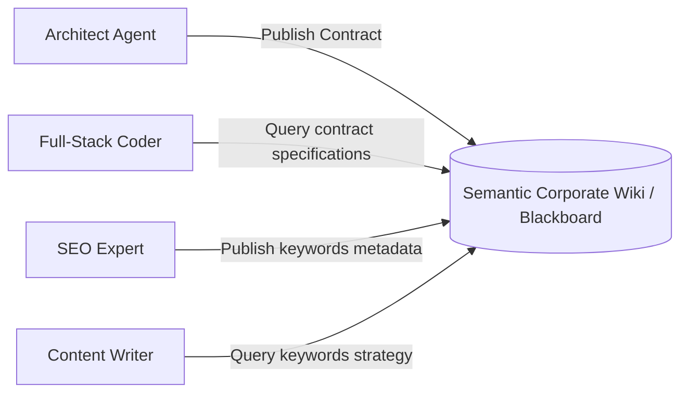
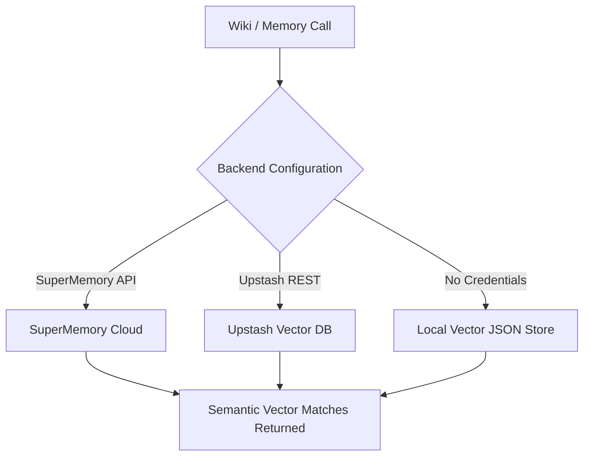

# ZilMate SDK: Wiki & Memory Systems

ZilMate provides agents with two distinct storage backends: **Episodic Long-Term Memory** (to capture user preferences, settings, and conversational patterns) and the **Semantic Corporate Wiki** (which serves as a shared blackboard for persistent architectural contracts, deliverables, and schemas).

---

## 1. Episodic Long-Term Memory

Episodic memory captures short, actionable items that personalize agent behavior.

```typescript
import { createZilMate } from 'zilmate/server';

const zilmate = createZilMate({ sessionId: 'developer-workspace' });

// 1. Remember user preference
await zilmate.remember({
  text: 'The production database is hosted on Supabase, inside the zilo-prod-main project.',
  tags: ['database', 'prod-env']
});

// 2. Recall memory during a workflow
const memories = await zilmate.recall({ query: 'Where is our database hosted?', limit: 5 });

memories.forEach((mem) => {
  console.log(`[Tags: ${mem.tags.join(', ')}] Memory: ${mem.content}`);
});
```

### Episodic Methods Reference

- `remember({ text, tags })`: Records a memory and labels it with tags.
- `recall({ query, limit })`: Conducts a semantic search across memories.
- `listMemories()`: Returns all captured memories.
- `forget(id)`: Removes a memory by its unique ID.
- `clearMemories()`: Deletes all memories.

---

## 2. Semantic Corporate Wiki (Shared Blackboard)

The **Corporate Wiki** is a semantic blackboard. When the `architect` defines an API payload or the `marketAnalyst` maps competitor data, they publish it to the Wiki. Any subsequent agent in the swarm can query the Wiki to ensure consistency.



### Publishing and Querying the Blackboard

```typescript
import { createZilMate } from 'zilmate/server';

const zilmate = createZilMate();

// 1. Publish a technical specification sheet
await zilmate.publishToWiki({
  title: 'Authentication JWT Contract v2',
  content: `
    Issuer: zilo-auth-gateway
    Algorithm: RS256
    Claims Expected:
      - sub (user unique uuid)
      - email (string)
      - roles (array of strings, e.g. ["admin", "developer"])
  `,
  tags: ['security', 'auth', 'spec']
});

console.log('🌌 Document published to Corporate Wiki.');

// 2. Query the specs from another service thread
const specResults = await zilmate.queryWiki({
  query: 'How should I decode user roles in the JWT?',
  limit: 2
});

specResults.forEach((spec) => {
  console.log(`\n📄 [Score: ${spec.score}] Document: ${spec.title}`);
  console.log(spec.content);
});
```

---

## 3. Storage Providers Configuration

ZilMate is designed to run in any hosting environment. It supports multiple backend vector store integrations, falling back gracefully to local files to avoid initialization blockers during testing.



### A. Local JSON Vector Store (Zero Config)

Ideal for local development. Memories and wiki entries are stored locally as serialized files in `~/.gemini/antigravity` or your configured `ZILMATE_WORKSPACE`.
- **Requirements**: None. Default fallback layer.

### B. Upstash Vector Database

Perfect for serverless environments (like Vercel or AWS Lambda) where file system writes are not persistent.
- **Set Environment Variables**:
  ```env
  CORPORATE_WIKI_PROVIDER=upstash
  UPSTASH_VECTOR_REST_URL=https://your-index.upstash.io
  UPSTASH_VECTOR_REST_TOKEN=your-upstash-token
  ```

### C. SuperMemory Cloud

Leverage SuperMemory's highly robust dashboard, scraping engines, and RAG index.
- **Set Environment Variables**:
  ```env
  CORPORATE_WIKI_PROVIDER=supermemory
  SUPERMEMORY_API_KEY=your-supermemory-api-key
  ```
